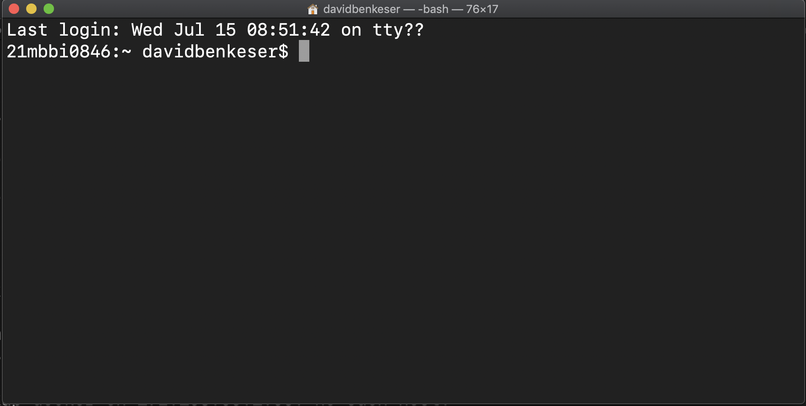

```{r xaringan-themer, include=FALSE, warning=FALSE}
library(xaringanthemer)
# define a class for a block of text with mono spaced print
extra_css <- list(
  ".monobox" = list(
    display = "inline-block", 
    width = "90%",
    height = "400px",
    padding = "5px",
    border = "1px solid #012169",
    `background-color` = "#d9d9d6",
    `font-family` = "Courier Prime",
    `align-items` = "left",
    `vertical-align` = "middle"
  ),
  ".small" =  list(`font-size` = "80%"),
  ".large" =  list(`font-size` = "150%"),
  "ul li" = list(`margin-bottom` = "10px"),
  ".red" = list(color = "#da291c",
                `font-weight` = "600")
)

style_mono_accent(
  base_color = "#012169",
  header_font_google = google_font("DM Sans"),
  text_font_google   = google_font("DM Sans", "400", "400i"),
  code_font_google   = google_font("Courier Prime"),
  extra_css = extra_css
)
```
<style type="text/css">
.remark-slide-content {
    font-size: 22px
}
</style>

## Operating systems

* Windows
  * Not programmer friendly
* Mac OSX
  * Better for programming
  * Under the hood, is just unix
* Unix-based OS (Linux, Solaris, etc...)
  * Best for programming

We'll learn to interact with our computer like it's a Unix OS. 
* Best practices for programming
* Uniformity for pedagogical purposes
* Needed for AWS and Docker (later)

---

## Some terminology

__Shell__
* user interface for interacting with a computer
* the "outermost" layer of the operating system

__Graphical user interface__ (GUI)
* visual interface (icons, menus, etc...) for interacting with computer
* Don't touch that mouse!

__Command line interface__ (CLI)
* text-based interface for interacting with computer
* e.g., `bash`, `sh`, `tcsh`, `zsh`, ...

???

As I'll say many times, I am not a computer scientist, so I may say
something stupid here. Please correct me if you know better!

GUIs are pretty and user-friendly because anyone who can read and operate
a mouse can interact with them, even with very little about computers. 
However, they are antithetical to our endeavor for reproducible research.

We will instead rely on the CLI to run all our programs. We will focus on 
`bash`, mostly because it's all that I know. People also seem to like `zsh`. 

---

## Some terminology

__Shell script__
* plain text file designed to be run by the shell

__Terminal__
* "terminal emulator"
* a program that lets you interact with the shell

__Important principle:__ Everything scripted!

???

Scripts are the ultimate "paper trail". We can scrutinize the script
to see exactly what the computer was told to do. We are working toward
scripting all aspects of data cleaning, analysis, and report generation. 

---

## Terminal

If Windows, use [Ubuntu](https://www.microsoft.com/en-us/p/ubuntu/9nblggh4msv6?activetab=pivot:overviewtab) for Windows
* Or other Linux distribution (e.g., [Debian](https://www.microsoft.com/en-us/p/debian/9msvkqc78pk6?rtc=1&activetab=pivot:overviewtab))
* Biggest difference is how software installed

<div>

If Mac, use [Terminal](https://support.apple.com/guide/terminal/open-or-quit-terminal-apd5265185d-f365-44cb-8b09-71a064a42125/mac)
* Or [iTerm2](https://www.iterm2.com/features.html) -- more features

<div>

If Linux, whatever terminal emulator comes with your distribution. 

???

I use Terminal, but should probably switch to iTerm2. 

Linux on Windows is a relatively new feature. I suggest Ubuntu or Debian
as these are the most common distributions on resources you might use. 
There's practically little difference for our purposes. Most of my 
examples later will likely use Ubuntu though, so if you have no strong
preference, then I'd stick to that. 

---

## Terminal

.center[]

???

The terminal is the way we interact with the shell by issuing text-based
commands.

We'll be working with bash. If for some reason bash is not the default 
shell (and you want it to be) this can be changed in Terminal settings.

---

## Moving around directories

| __Command__   | __Action__                   |
|:-------------:|------------------------------|
| `pwd`         | print working directory      |
| `cd`          | change directory             |
| `ls`          | list files in directory      |

<div>

.pull-left[.center[
Absolute paths
* .left[`/Users/davidbenkeser`]
* .left[`~/Documents`]
* .left[`/`]
]]

.pull-right[.center[
Relative paths
* .left[`./Documents`]
* .left[`../Documents`]
* .left[`../../`]
]]

???

The next few slides are boring, but we will use these basic commands
to illustrate how we interact with the shell. 

Use these commands to explore file structures.

Absolute paths include the __whole path__ for a directory. The `~` 
symbol refers to the current users home directory. Execute `eval echo ~$USER`
to print its location. `/` takes you to the root directory. 

Relative paths depend on the working directory that they are executed in.
The `./` means "in the current directory". The `../` means "in one directory
up from the current directory". The `../../` means "in two directories up
from current directory". 

When we get to project management, we will prefer relative paths. It makes
sharing code easier -- between different users or, with yourself, on a 
difference computer (e.g., your laptop vs. AWS). The two file systems are probably 
(definitely) structured differently, but if they share a  project folder with 
the same relative structure, then code with relative paths should still work.

---

## Adding/removing files

| __Command__     | __Action__                   |
|:---------------:|------------------------------|
| `mkdir`         | make a new directory         |
| `rm`            | delete a file or directory   |
| `mv`            | move a file or directory     |
| `cp`            | copy a file or directory     |

---

## Commands structure

.center[`command [-option(s)] [argument(s)]`]

* `option(s)` are preceded with a `-` or `--`
  * `-` options are a single letter
  * `--` options are longer, informatively named, but can differ in across distributions/shells (I think)

* `argument(s)` tell the command what to operate on
  * `rm` what? `cp` what?

To see available options check `man command`.

???

The `man`'s for the various commands are sometimes not as helpful
as just googling, "How do I ... `command` bash".

You can string together multiple `-` options, e.g., `ls -la` executes
as `ls -l -a`.

---

## Solving computing problems

* `man [command]` 
* Google (with `site:stackoverflow.com`?)
* Ask friends/classmates
* .red[Try stuff!]

Breakout exercises are designed to force you to try new things.
* Learning how to learn!

???

I find manuals for Unix commands are often cryptic and not always helpful. 
Reading them on occasion is still useful. 

Learning to code is a lot like a learning a language. It can be very
frustrating that you know *what* you want to say, but you don't know 
*how* to say it (or you know how, but in another language!). You only
get better at language by forcing yourself to use it.

Don't be satisfied with just copy/pasting an answer from StackOverflow. 
Try (for at least a couple minutes) to understand how it works. This is 
a worthwhile investment. 

---

## Breakout exercise 1

Execute the following code:
```{bash, exercise1, eval = FALSE}
# make a directory named tmp
mkdir tmp
# move into tmp 
cd tmp
# add an empty file named tmp_file
touch tmp_file
# add an empty directory named another_tmp
mkdir another_tmp
# add an empty file to another_tmp directory
touch another_tmp/another_tmp_file
```
* In your breakout group, figure out how to...
  * list all files with sizes displayed in bytes/kilobyes/megabytes
  * remove `tmp_file`
  * rename `another_tmp_file` to `such_a_cool_file`
  * remove `tmp` directory *and* all its contents

???

~ 7 minutes.

---

### Breakout 1 poll

<iframe src="https://www.pollev.com/davidbenkese180" width="100%" height="500px" frameborder="0">

---

### Breakout 1 poll results

<iframe src="https://www.polleverywhere.com/multiple_choice_polls/dSPG7cHUA2zOIEhTiPHo9?preview=true&controls=none" width="100%" height="500px" frameborder="0">

---

## `.bash_profile`

`.bash_profile` is a plain text file that makes your life easier. 
* set `PATH` variable
* make `alias`'es for common commands 

Example:
```{bash, bash-profile, eval = FALSE}
# modify PATH
export PATH=.:/usr/local/bin:$PATH
# shortcut for listing
alias ll='ls -lh'
# shortcut for opening chrome from browser
alias chrome="open -a 'Google Chrome'"
```

.red[Use of aliases within your code can create reproducibility issues!]

???

The most important aspect of your bash_profile is `PATH`. This variable 
defines the set of directories where the shell will look for executable 
programs. In other words, when you give the shell a command, these are 
the folders where the computer "looks" to figure out how to execute that
command. 

We can add `.` (the current directory) to the path to be able to execute
shell scripts with commands like `myscript.sh` instead of `./myscript.sh`.

Aliases are convenient for interactively operating with the shell; 
however, avoid using aliases in scripts that you will share, as the 
execution of those scripts is now reliant on having the same bash_profile
across multiple machines. 

---

## Redirects and pipes

| __Command__     | __Action__                              |
|:---------------:|-----------------------------------------|
| `>`             | redirect output to file                 |
| `>>`            | redirect output and append to file      |
| `<`             | have input come from a file             |
| <code>&#124;</code> | output of command becomes input of next | 

Piping and redirects give you __flexibility__ in coding. 

???

Here, output means "stdout" and input means "stdin".

---

## To bash or not to bash

```{bash, hamlet, eval = FALSE}
# download hamlet text from web and save 
# in file called hamlet.txt
curl -L http://bit.ly/hamlet_txt > hamlet.txt

# lines the string "Ham" mentioned
grep "Ham" hamlet.txt

# lines with "Oph" and "Ham"
grep "Ham" hamlet.txt | grep "Oph"

# count Hamlet's lines
grep "Ham\." hamlet.txt | wc -l

# see the start of Hamlet's first 5 lines
grep "Ham\." hamlet.txt | head -5

# see the start of Hamlet's last line
grep "Ham\." hamlet.txt | tail -1 
```

???

`curl` is useful for downloading text files from the web. `-L` means to 
follow any re-directs.

`wget` also useful for web downloads.

`head`, `tail`, and `wc` are generally useful commands. 

---

## Breakout exercise 2

In your breakout group, write bash code that executes each of the following. 
* find "To be, or not to be" and write the contents of this monologue to a file `speech.txt` (hint: the speech is 35 lines)
* make a file called `greatest_hits.txt` that includes:
  * the "To be, or not to be" speech
  * the line that includes "know not what we may be"
  * all lines that include the word "doubts" or "Doubts"
* replaces all instances of the string "doubts" with "uncertainties" in your `greatest_hits.txt` file (hint: `sed` or `awk`)

???

`sed` and `awk` are more flexible than `grep`, but I find the syntax very cryptic and
difficult to remember. I often have to Google to remind myself how it works.

~ 10-15 min

---

### Breakout 2 poll

<iframe src="https://www.pollev.com/davidbenkese180" width="100%" height="500px" frameborder="0">

---

### Breakout 2 poll results

<iframe src="https://www.polleverywhere.com/multiple_choice_polls/dSPG7cHUA2zOIEhTiPHo9?preview=true&controls=none" width="100%" height="500px" frameborder="0">

---

## Wild cards

| __Command__     | __Action__                              |
|:---------------:|-----------------------------------------|
| `*`             | match anything                          |
| `?`, `??`, ...  | match a single character                |
| `[...]`         | match a range of characters             |

```{bash, wildcards, eval = FALSE}
# files in cwd with .txt extension
ls -l *.txt
# all files in cwd named a_file with three character extension
ls a_file.???
# .txt files in cwd name a_file, b_file, ..., e_file
ls [a-e]_file.txt
```

---

## Moving around command line

| __Key stroke__         | __Action__                              |
|:----------------------:|-----------------------------------------|
| <code> &#8593;</code>  | move to previous command                |
| <code> &#8595;</code>  | move to next command                    |
| `tab`                  | autocomplete command or file            |
| `ctrl+c`               | cancel (running) command                |
| `ctrl+z`               | suspend command                         |
| `ctrl+r`               | search for command in history           |
| `ctrl+l`               | clear the screen                        |

???

If you take nothing else from this page, remember to use `tab`!

---

## Variables

Variables are 
* assigned using `=` ;
* referenced using `$` (possibly with `${}`).

```{bash, variables, eval = FALSE}
# bad -- no spaces!
a = "some"
# good
a="some"

# references a
echo a
echo $a
echo "The value of a is $a"

# curly braces are for avoiding ambiguity
echo "I am printing $athing"
echo "I am printing ${a}thing"
```

???

Remember the command structure: `a = 12` gets interpreted as "run command 
`a` with options `=` and `12`".

---

## More tools

`$(command)` executes `command` and returns its output.

```{bash, command-subst, eval = FALSE}
# a sequence
seq 1 10
# save the sequence as a variable
my_sequence=$(seq 1 10)
echo $my_sequence
```

`(())` performs operations. 

```{bash, command-subst2, eval = FALSE}
b=$((12 + 2))
((b + 2))
((b++))
```

???

Execute the code above and check the value of `b` after each line to see 
how its value changes.


---

## More tools

Using `for` loops:

```{bash, for-loops, eval = FALSE}
for name in Ronald Ozzie Freddie
do
  echo "My name is $name."
done
```

`if` statements:

```{bash, if-statements, eval = FALSE}
for i in {1..5}
do
  if [ "$i" == "3" ]
  then 
    echo "This is a special iteration"
  else
    echo "This is iteration $i"
  fi
done
```

???

Note the use of `{1..5}` to generate a sequence

---

## Shell scripts

All scripts will start with a __shebang__. 
* `#!` followed by file path to program that executes code.

Find where `bash` lives on your computer: 

```{bash, where-bash, eval = FALSE}
which bash
```

The first line of my shell script will read:

```{bash, my-shebang, eval = FALSE}
#! /bin/bash
```

???

Remember the importance of `PATH` here. `which` looks through all 
folders in your `PATH` for an executable named `bash`. 

---

## Shell scripts

Example bash script:

```{bash, bash-script, eval = FALSE}
#! /bin/bash
# comments use # symbol
# you may need to replace shebang!

# define a variable
a="bash"

for i in "very" "so much" "incredibly"
do
  echo "$a is $i fun"'!'
done
```

Save this file as `first_script.sh`.

???

Congrats, you've written your first shell script!

---

## Shell scripts

Tell the shell that it is allowed to execute `first_script.sh`

```{bash, chmod, eval = FALSE}
chmod +x first_script.sh
```

Execute first script: 

```{bash, run-script, eval = FALSE}
first_script.sh
```

???

If `.` is not in your path, then you need to execute `./first_script.sh`.

After you run the script, notice that the variables created inside the script,
`a` (and `i` from the loop) are not available to you outside the script. 

---


## File permissions

If you run `ls -l`, the far left column shows file permissions:
* e.g., `-rw-r--r--` or `drwxr-xr-x`

First character is __file type__. Then comes __read__ (`r`), __write__ (`w`), and execute (`x`) permissions for __user__, __group__, __others__.

Executing `+x` (essentially) makes the file executable for everyone.

See slide notes for more options for `chmod`.

???

Often, you'll see commands like `chmod 755 file.sh`. To understand this way 
of setting permissions, think about a series of bits (how the computer 
interprets your settings): 

`rwx rwx rwx = 111 111 111`  
`rw- rw- rw- = 110 110 110`  
`rwx --- --- = 111 000 000`  
and so on...  Thus,  
`rwx = 111`, which in binary = 7  
`rw- = 110`, which in binary = 6  
`r-x = 101`, which in binary = 5  
`r-- = 100`, which in binary = 4  
`--- = 000`, which in binary = 0  

Some common values summarized below: 

| __Value__         | __Meaning__                                  |
|:-----------------:|----------------------------------------------|
| `777`             | No restrictions. Everyone can do anything.   |
| `755`             | Owner writes. Everyone can read and execute  |
| `700`             | Owner can do everything. Others nothing.     |
| `644`             | Owner can read/write. Others can read only.  |

---

## Breakout exercise 3

Write a script that 
* uses `curl` to download the text of __Romeo and Juliet__ from Project Gutenberg
  * http://www.gutenberg.org/files/1112/1112.txt ;
* counts the number of lines for characters Romeo ("Rom."), Juliet ("Jul."), and the Apothecary ("Apoth."); 
* saves a plain text file that for each of these characters says:
  * "`[character]` has `[num]` lines".

__Hints__: use `for` loops; recall how to "escape" `.`


???

~ 15 min.

---

### Breakout 3 poll

<iframe src="https://www.pollev.com/davidbenkese180" width="100%" height="500px" frameborder="0">

---

### Breakout 3 poll results

<iframe src="https://www.polleverywhere.com/multiple_choice_polls/dSPG7cHUA2zOIEhTiPHo9?preview=true&controls=none" width="100%" height="500px" frameborder="0">
