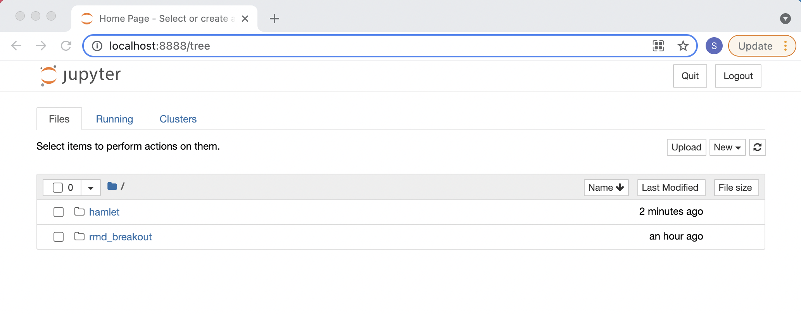
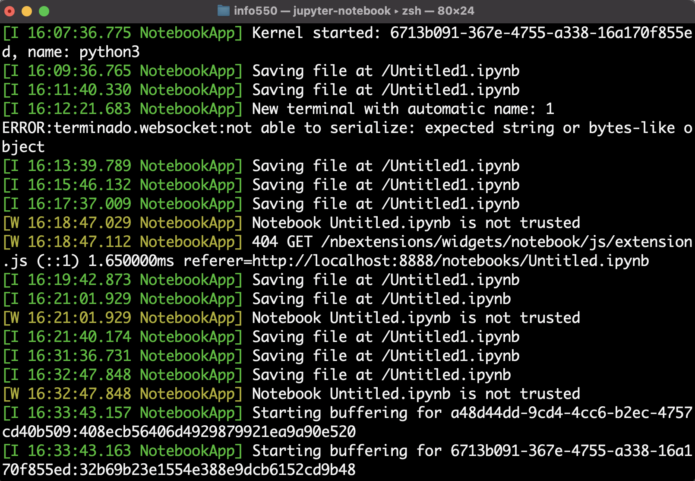
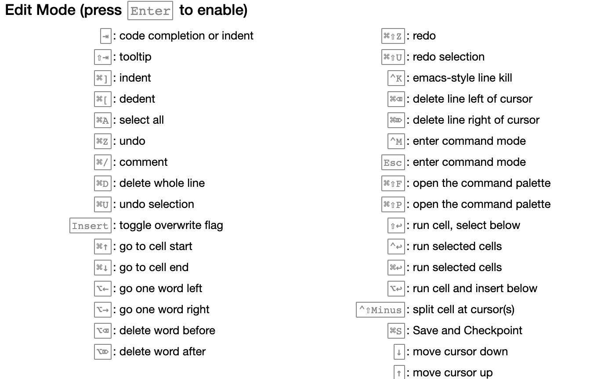
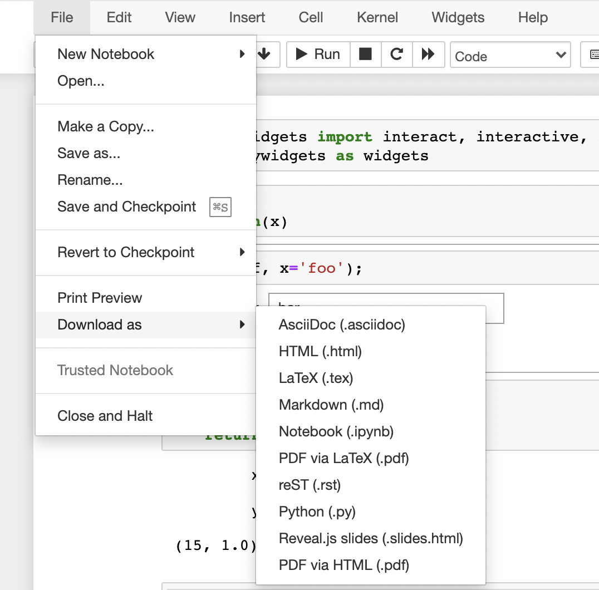

```{r xaringan-themer, include=FALSE, warning=FALSE}
library(xaringanthemer)
extra_css <- list(
    "ul" = list(`margin-bottom` = "0.5em",
      `margin-top` = "0.5em"),
        "p" = list(`margin-bottom` = "0.25em"),
        "ul li" = list(`margin-bottom` = "10px"),
        "a" = list(color = "#007dba"),
        "a:hover" = list("text-decoration" = "underline"),
        ".green" = list(color = "#348338"),
        ".red" = list(color = "#da291c")
)
style_mono_accent(
  base_color = "#012169",
  header_font_google = google_font("DM Sans"),
  text_font_google   = google_font("DM Sans", "400", "400i"),
  code_font_google   = google_font("Courier Prime"),
  extra_css = extra_css
)
```
<style type="text/css">
.remark-slide-content {
    font-size: 22px
}
</style>

## An interactive way to create reports

Imagine taking a compiled Rmarkdown report and typing directly into each code or markdown chunk!
 
* Run code chunks one at a time
* Make changes to text, figures, and other output without recompiling
* Write bash code within the notebook to install packages
* Easily embed HTML into text chunks 
* Share your report as HTML, PDF, and more
* Share your notebook so others build off your work 

---

## Jupyter Notebooks vs. Rmarkdown


Rmarkdown is best for:

* Polished reports
* Detailed formatting
* Seamlessly weaving output into documents without showing code
* R

Jupyter Notebooks is best for:

* Interactivity
* Collaboration
* Exploratory analysis 
* Python


---

## JSON files

* Jupyter Notebooks are saved as .ipynb files
* .ipynb files are [JSON](https://www.json.org/json-en.html) (Java Script Object Notation) files
* JSON files are just plain text and thus can be read/created in any programming language
* For python users: syntax looks just like a [python dictionary](https://docs.python.org/3/tutorial/datastructures.html#dictionaries)


---

## Opening Jupyter Notebooks

* Navigate to your project directory and run this command in terminal

```{bash, openjn, eval = FALSE}
jupyter notebook
```

* A browser window will open with address `http://localhost:8888/tree`
* You should see the files that live in the current directory


<center>
```{r, echo = FALSE, out.width = "600px"}

```
</center>

---

## Kernels

From the Jupyter Notebook docs:

"Kernels are programming language specific processes that run independently and interact with the Jupyter Applications and their user interfaces."

Find a list of all available kernels [here](https://github.com/jupyter/jupyter/wiki/Jupyter-kernels). We are most interested in:

* [Ipython](https://ipython.org/)
* [IRKernel](https://irkernel.github.io/)


---

## Closing Jupyter Notebooks

.pull-left[
* Closing the browser tab .red[will not stop the server] or shutdown notebooks 
* __Ctrl + c__ stops the server and shuts down all running notebooks
* Shutting down a notebook .red[kills the R/Python session]
* To keep the server running, the terminal window we ran `jupyter notebook` from must be kept open
]

.pull-right[

```{r, echo = FALSE, out.width = "500px"}

```

]


---

## Breakout Exercise 1

* Open a jupyter notebook
* Close the browser tab that opened automatically
* Figure out how to reopen the JN session in your browser


---

## Keyboard Shortcuts

There are tons of shortcuts! Don't need to learn them all.

<br> 

<center>
```{r, echo = FALSE, out.width = "600px"}

```
</center>

---

## Magics (only for Ipython)

Magics are special commands that add functionality not readily available by just writing Python code and using the JN interface.

* Line magics start with `%`
* Cell magics stare with `%%`
* Run `%lsmagic` in a cell to list all available magics
* Many many magics!
* `%%bash` turns the whole cell into a bash cell
* `%%HTML` turns the whole cell into an HTML cell
* `%who_ls` lists all objects saved in the notebook
* `%timeit` provides a convenient way to time your code

---

## IRkernel magics?

.center[*We don’t and won’t support %%cell magic like %%HTML.*]

.center[\- The IRkernel dev team]

<br> 

* Use the `system()` function to write bash code
* Use the `IRdisplay` library to embed images, html, etc

---

## Widgets (Ipython only)

Build interactive GUIs in your notebooks! From terminal, run:

```{bash, install_widg, eval = FALSE}
pip install ipywidgets
```

Then, to test out basic widget functionality, within a code cell in an Ipython notebook, run:

```{bash, import_widg, eval = FALSE}
from ipywidgets import interact, interactive, fixed, interact_manual
import ipywidgets as widgets
```

---

## Widgets (Ipython only)

__Example__: The `interact` widget generates UI controls for function arguments then calls the function with those arguments when you manipulate the controls interactively

```{bash, interactive_plot, eval = FALSE}
from ipywidgets import *
import numpy as np
import matplotlib.pyplot as plt
%matplotlib inline

x = np.linspace(0, 2 * np.pi)

def update(w = 1.0):
    fig = plt.figure()
    ax = fig.add_subplot(1, 1, 1)
    ax.plot(x, np.sin(w * x))

    fig.canvas.draw()

interact(update);
```


---

## Interactive plots with plotly 

[`plotly`](https://plotly.com/) is a great library for making interactive plots.
* [Example plots for R](https://plotly.com/r/)
* [Example plots for python](https://plotly.com/python/)

```{r, plotly_ex, eval = FALSE}

library(plotly)

set.seed(123)

x <- rnorm(1000)
y <- rchisq(1000, df = 1, ncp = 0)
group <- sample(LETTERS[1:5], size = 1000, replace = T)
size <- sample(1:5, size = 1000, replace = T)

ds <- data.frame(x, y, group, size)

plot_ly(ds, x = x, y = y, mode = "markers", split = group, size = size, type = 'scatter') %>%
  layout(title = "Scatter Plot")

```

* Works with both Ipython and IRkernel!

---

## R and Python in the same notebook

R and python can be used in the same notebook via [`rpy2`](https://rpy2.github.io/).

```{bash, installrpy2, eval = FALSE}
pip install rpy2
```

```{bash, userpy21, eval = FALSE}
%load_ext rpy2.ipython
import pandas as pd
import numpy as np
df = pd.DataFrame({
    'cups_of_coffee': [0, 1, 2, 3, 4, 5, 6, 7, 8, 9],
    'productivity': [2, 5, 6, 8, 9, 8, 0, 1, 0, -1]
})
df.transpose()
```

```{bash, userpy22, eval = FALSE}
%%R -i df 
library(ggplot2)
ggplot(df, aes(x=reorder(cups_of_coffee,productivity), y=productivity)) + geom_col() + coord_flip()
```


---

## Sharing notebooks

* We can share notebooks as .ipynb files
* Remember, this is just a plaintext JSON file!
* Save the notebook and it will show up in the directory you opened JN from
* Share as you would any text file
* Make sure the person recieving has the necessary packages and versions (Docker where are you??)


---

## Exporting notebooks

* We can export to many different file formats for static viewing

<br> 

<center>
```{r, echo = FALSE, out.width = "400px"}

```
</center>


---

## Breakout Exercise 2

Here we'll work with the youtube video at this link: https://www.youtube.com/embed/dQw4w9WgXcQ


* Start a jupyter notebook session
* Start one Ipython kernel and one IRkernel
* Use a line magic to embed the video in the Ipython notebook (Hint: `%%HTML`)
* Use IRDisplay to embed the video in the IRkernel notebook (Hint: `IRdisplay::display_html()`)
* Save both notebooks as HTML files (save as something besides Untitled)
* Send both HTML files to someone in your breakout room
* Recieve two HTML files from someone in your breakout room
* Open the HTML files and watch the video


---


## Notebooks Online

* [mybinder](https://jupyter.org/try) 
  * Just for playing around
* [Google Colab](https://colab.research.google.com/) 
  * Not exactly JN but similar functionality 
  * Free access to CPUs/GPUs, and pre-built enviroments

