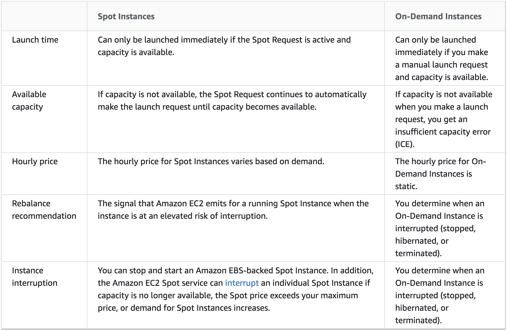

```{r xaringan-themer, include=FALSE, warning=FALSE}
library(xaringanthemer)

extra_css <- list(
  ".clearbox" = list(
    display = "inline-block", 
    width = "100%",
    padding = "5px",
    border = "1px solid #012169",
    `background-color` = "#d9d9d6",
    `align-items` = "left",
    `vertical-align` = "middle"
  ),
  ".small" =  list(`font-size` = "80%"),
  ".large" =  list(`font-size` = "150%"),
  ".huge" =  list(`font-size` = "400%"),
  "ul li" = list(`margin-bottom` = "10px"),
  ".red" = list(color = "#da291c",
                `font-weight` = "600"),
  ".green" = list(color = "#348338",
                `font-weight` = "600"),
  ".remark-code-line-highlighted" = list(border = "2px solid #f2a900",
                                         `background-color` = "#002451"),
  ".code-box" = list(display = "inline-block", 
    width = "95%",
    `line-height` = "1.25em",
    padding = "5px",
    `font-size` = "80%",
    `background-color` = "#f6f6f6",
    `align-items` = "left",
    `font-family` = "Courier Prime",
    border = "1px solid black"),
  "a" = list(color = "#007dba"),
  "a:hover" = list("text-decoration" = "underline")
)

style_mono_accent(
  base_color = "#012169",
  header_font_google = google_font("DM Sans"),
  text_font_google   = google_font("DM Sans", "400", "400i"),
  code_font_google   = google_font("Courier Prime"),
  extra_css = extra_css
)
```

<style type="text/css">
.remark-slide-content {
    font-size: 22px
}
</style>

## Why cloud computing?

__Computing/storing at scale__
* Your laptop/desktop/local HPC cluster may not have enough memory to handle a big data set. 

__Customizable resources__
* Different analyses may have different computational needs.
* Your analysis might require specific resources (e.g., GPU) that are not available locally.

__Compute from anywhere__
* Just need the internet!

Web-based services, industry applications, ...

---

## Why not cloud computing?

.huge[💰💰💰]
* easy to rack up quite a bill

__Infinitely customizable resources__
* overwhelming number of options; hard to know which matter
* documentation is difficult to parse

__Fine-tuning resources to your needs is hard__
* profiling memory/compute resources

???

Academia is now filled with tales of grad students inadvertently racking up thousands of dollars of charges. In reality, there are safeguards that you can put in place. But with everything so highly customizable, hard to know what's important.

---

## Disclaimers

.red[I am not a cloud computing expert]. I am barely even a novice.

The goals of this lecture are to give you __basics__ of:
* AWS command line interface `awscli`;
* using EC2 (compute) and S3 (storage) services.

Everything can also be done from a __browser GUI__ (i.e., the __AWS Console__), but... 

You should have downloaded and configured `awscli` for use with your AWS Educate account using these [instructions](breakoutsoln/awseducate_setup.html).

???

I want to give you enough insight that reading further documentation is not too daunting. But keep in mind, most of the use-cases for AWS are still industrial, web-based applications as opposed to research-focused ones. So, for now at least, much of the online help/tutorials are geared towards that crowd. It's a tough nut to crack, but this is the first step in that journey. 

---

## Configuring `awscli`

We need to first configure `awscli`, so that it knows your AWS credentials.

1. [Login](https://www.awseducate.com/signin/SiteLogin) to your AWS Educate.

2. Click __AWS Account__ and sign into your starter account.

3. __DO NOT REFRESH/LEAVE THIS PAGE FOR THE REST OF THE LECTURE.__

<br> 

Each session is three hours, at which point your credentials reset.
* Once your credentials expire, you'll have to remake your credentials file.
* With a regular AWS account, you just set credentials once.

---

## Configuring `awscli` 

In the `~/.aws` directory, we need to create two files:

`config`:

````
[default]
region = us-east-1
output = yaml 
````

`credentials`
````
[default]
aws_access_key_id=XXX
aws_secret_access_key=XXX
aws_session_token=XXX
````

Change `XXX` in the above to what you see under __"Account Details"/"Show"__.
* If you leave the page or refresh, these numbers will change and you will have to redo your `credentials` file.

???

Here `[default]` specifies that these are the default credentials. It is possible to have multiple sets of credentials and you can often override the default by including a `--profile` option to command calls. 

---

## Configuring `awscli`

Check that everything is working properly: 

````
$ aws ec2 describe-regions | head -5
Regions:
- Endpoint: ec2.eu-north-1.amazonaws.com
  OptInStatus: opt-in-not-required
  RegionName: eu-north-1
````

<br> 

For a standard account, you can use `aws configure`
* Don't need `aws_session_token`
* Only have to do it once. 

---

## Elastic compute (EC2) service

From [the docs](https://docs.aws.amazon.com/AWSEC2/latest/UserGuide/concepts.html), EC2 provides virtual computing environments, known as __instances__, and preconfigured templates for instances, __Amazon Machine Images (AMIs)__. 

Typical use case: you need to do some computing and do not have local resources to complete the job.

What will the workflow look like?
* Set up __security__ credentials
* Tell AWS what kind of __instance__ we want
* __Log into__ the instance using `ssh`
* Install programs, __run code__, etc...
* Get __results back__ to our local computer

---

## Security

There are three basic things to know about AWS security. 

1. __IAM Users__
  * "Users" of your AWS account and what they are allowed to do
  * Can you provision EC2 instances? Can you store files in S3? ...

2. __A key pair__
  * "Log-in info" specifying what you're allowed to do in EC2 instance

3. __A security group__
  * Controls who is able to access your instance
  * Restrict to your current IP address or a range of IP addresses

Additionally, you should [enable multi-factor authentication](https://docs.aws.amazon.com/IAM/latest/UserGuide/id_credentials_mfa_enable_virtual.html).

---

## IAM Users

IAM users are __not enabled in AWS Educate__ starter accounts, but let's pause to discuss what they are and why they're important. 

When you sign up for an AWS account, you create a __root user__, an account that can do whatever it wants in AWS. 

It is [suggested](https://docs.aws.amazon.com/IAM/latest/UserGuide/introduction.html) that you set up IAM users to specifically manage permissions. 
* Even if you are the __only one__ using the account.

???

If you work for an organization that uses AWS, chances are you will be given IAM credentials to access their resources. This allows them to control what services of AWS you use. 

If you are using AWS for personal use, it's still a good idea to follow best practices of accessing resources via an IAM profile. It adds an extra layer of security for you to keep your credit card information separate from the way that you are logging into remote instances. 

---

## Key pair

To login to an AWS instance, you will need a __key pair__; literally like a key. 
* You have a __private key__ that lives on your local computer. 
* AWS has a __public key__ (i.e., a lock) that lives on their virtual computer. 

We will generate a key pair from the command line as follows:

````bash
$ aws ec2 create-key-pair --key-name aws_laptop_key \
--query 'KeyMaterial' --output text > \
~/.ssh/aws_laptop_key.pem
$ chmod 400 ~/.ssh/aws_laptop_key.pem
````

* You can give whatever `key-name` you like.
* You can save the file wherever you like. Here, I'm putting it in `~/.ssh`, a common place to store keys.
* The `chmod` command makes the key read-only for you.
* .red[Don't show anyone your private key!]

---

## Security group

We will __further restrict access__ by selecting what IP addresses can log in to the machine.
* To do this, we set up a __security group__. 

Run `aws ec2 describe-vpcs` and find `VpcId`. It will be something like `vpc-2d8c4750`. 

````bash
$ aws ec2 create-security-group --group-name my-sg \
--description "ssh from current IP address" \
--vpc-id vpc-2d8c4750
````

You should see output showing `GroupID` with your security group ID. 


???

Here we're setting up a security group for EC2 VPC (as opposed to EC2 classic). See [docs](https://docs.aws.amazon.com/cli/latest/userguide/cli-services-ec2-sg.html) for setting up on EC2 classic. 

---

## Security group

We will __add your current IP address__ to this security group as follows.

* Find your __current IP address__.

````bash
$ my_ip=$(curl https://checkip.amazonaws.com)
$ echo $my_ip
````

* Add to __security group__; change `group-id` to output from previous slide.

````bash
$ aws ec2 authorize-security-group-ingress \
--group-id sg-0af9981424cb188b1 \
--protocol tcp --port 22 --cidr $my_ip/32
````

???

Unfortunately, this is pretty convoluted stuff. In short, we'll eventually be using `ssh` to access our EC2 instance. `ssh` connects via `tcp` on port `22`, so we're basically telling AWS that this security group allows incoming traffic on that port from your current IP address. 

If you were to try to access your instance from a different IP address, then it will not work; you'd need to modify the security group of your instance. 

---

## Instances and AMIs

An __Amazon Machine Image__ (AMI) is a template that contains a software configuration. 
* Like a __Docker image__
* What OS do you want? What software do you want?

An __instance__ is a copy of the AMI running as a virtual server in the cloud.
* Like a __Docker container__, but running on a big computer somewhere in Virginia or Ohio that is running multiple containers at the same time.
* How many __CPUs__ do you want? How much __memory__ do you want?

Once an instance is launched, you can __sign in to that instance__. 
* Like interactively entering Docker container.

???

There are important technical distinctions between a virtual machine and what Docker is, but some of the key ideas are the same. The AMI tells AWS what you want your environment to look like in terms of OS and software, while the image additionally includes specifications like how much memory and how many CPUs you want to use. 

You can also configure instances to launch and run a script automatically, which we may get to in when we talk about `awscli`. 

---

## Amazon Machine Images

There are an [incredible amount](https://aws.amazon.com/marketplace/) of AMIs available. 
* Linux and Windows systems are available.

What __OS__ do you want? 
* Recommend sticking for now with Ubuntu or similar.

Remember: any __software__ that you want beyond what is included in your AMI __will need to be installed__ on the instance.
* Docker can be helpful here! 
  * But you'll have to configure docker, at least on EC2
  * [ECR](https://aws.amazon.com/ecr/) and [Batch](https://aws.amazon.com/batch/) are Docker-oriented services.

???

You can spend a lot of time chasing down compilers etc... AWS is basically handing you an (at least almost) clean, new computer. If you want to run e.g., R, you will need to install it. So you may end up going through similar painful processes as with installing R on WSL or from command line in Mac. 

---

## Amazon Machine Images

Since we will be spinning up instances from the command line, we will need the ID for the AMI that we'd like to use. 


Here are a few useful ones:
* Ubuntu 20.4 
  * `ami-0885b1f6bd170450c` (64-bit x86)
* Amazon Linux 2
  * `ami-0947d2ba12ee1ff75` (64-bit x86)
* Red Hat Enterprise Linux 8
  * `ami-098f16afa9edf40be` (64-bit x86)

---

## Instance type

There are also an [incredible amount](https://aws.amazon.com/ec2/instance-types/) of instance types.

How many __CPUs__ do you want?
* Do you have code running in parallel? More CPUs = faster execution

How much __memory__ do you want?
* Do you need to load large Docker containers? Large data sets?

Do you need __GPUs__? Do you need really fast __read/write__? ...

The __T2 series__ is a good starting point.
* `t2.micro` available with free tier, but memory is small. 
* `t2.large` is what I have often use for moderate computations.

???

t2.micro is too small to be useful for most computing, but you can access it using the free tier, so that's how we'll start exploring AWS. I have found that I need to go up to about a t2.large in order to have sufficient memory to do the types of computing that I need.

---

## Running EC2 instance

We're finally ready to run an instance!

````bash
$ aws ec2 run-instances --image-id ami-0885b1f6bd170450c \
--count 1 --instance-type t2.large \
--key-name aws_laptop_key \
--security-group-ids sg-0af9981424cb188b1
````

* replace `key-name` with the key you generated
* replace `security-group-ids` with the security group you created

You will see a long list of output. If needed, hit `q` to return to command line.

---

## Running EC2 instance

When you submit that command, AWS __provisions your virtual machine__.
* After a minute or so, your image should be up and running. 

<br> 

You can retrieve the __public IP address__ of your virtual machine as follows.

````bash
$ public_ip=$(aws ec2 describe-instances \
    --query Reservations[*].Instances[*].PublicIpAddress \
    --output text)
$ echo $public_ip
````

???

Note all of these `describe-instances` commands will only work if this is your only running instance. Otherwise, multiple IP addresses will be saved. 

---

## Running EC2 instance

You can now log in to your machine using `ssh`.

````bash
$ ssh -i ~/.ssh/aws_laptop_key.pem ubuntu@${public_ip}
````

* `ubuntu` is the default user name for Ubuntu images.
* For other images, try `ec2-user@...` or `root@...`.

You will see a __warning message__:

````markdown
The authenticity of host 'XXX' can't be established.
ECDSA key fingerprint is XXX.
Are you sure you want to continue connecting (yes/no/[fingerprint])?
````

* Type `yes` and hit enter.

.green[You are now computing in the cloud!] 😎

---

## Terminating an instance

You now have a __virtual computer in the cloud__. What next?

* .red[Remember to turn it off when you're done!]
  * Don't run this command yet, but do remember to when we're done!
* .red[Instances do not stop running when you sign out.]
  * You have to __explicitly turn it off__ or specify this behavior.

````bash
$ instance_id=$(aws ec2 describe-instances \
    --query Reservations[*].Instances[*].InstanceId \
    --output text)
$ aws ec2 terminate-instances --instance-ids $instance_id
````

After some time, check to make sure `State` is `terminated`.

````bash
$ aws ec2 describe-instances
````

---

## Installing software on EC2 instance

Install programs, packages, etc... that you need. 

E.g., install `R` and `awscli` on Ubuntu:

````bash
$ sudo apt-key adv --keyserver keyserver.ubuntu.com \
--recv-keys E298A3A825C0D65DFD57CBB651716619E084DAB9
$ sudo add-apt-repository 'deb https://cloud.r-project.org/bin/linux/ubuntu focal-cran40/'
$ sudo apt-get update
$ sudo apt-get install -y r-base
$ sudo apt-get install -y awscli
````

Anything we have __installed via command line__ can be __installed on your image__. 
* E.g., [install Docker on Ubuntu](https://docs.docker.com/engine/install/ubuntu/)

???

The first two lines of the `bash` ensure that we are installing the most recent version of `R` for Ubuntu. From [here](https://linuxize.com/post/how-to-install-r-on-ubuntu-20-04/).

More docs on installing `R` and R Studio server on AWS image.

---

## Creating your own AMI

.red[Once you terminate an image, everything is deleted!]

How can we "save our workspace"?
* [Create](https://docs.aws.amazon.com/cli/latest/reference/ec2/create-image.html) our own AMI. 
* .red[It costs money to store your image.]

````bash
$ aws ec2 create-image --instance-id $instance_id \
--name "Ubuntu and R and awscli" --description "Base R and awscli"
$ my_ami="ami-0b56ddda752b70ca2"
````

This will return an `ImageID` that you can reference in the `--image-id` option of `aws ec2 run-instances`. 
* Here, we save that as a local variable name `my_ami`.
* It will also __log out__ of your image, but __does not terminate__ it.

---

## Deleting an AMI

There are two steps to __deleting a self-registered AMI__: 
* .red[Don't run these commands yet.] We'll use this AMI later.

* __De-register__ the image.

````bash
$ aws ec2 deregister-image --image-id $my_ami
````

* __Delete the snapshot__. 

````bash 
$ snapshot_id=$(aws ec2 describe-snapshots --owner-ids self \
--query "Snapshots[*].{Id:SnapshotId}" \
--output text)
$ aws ec2 delete-snapshot --snapshot-id $snapshot_id
````

---

## Moving files to and from image

We can use `scp` to move files to and from image.

From local computer to image (on local computer):

````bash
$ scp -i ~/.ssh/aws_laptop_key.pem \
path/to/local/file ubuntu@$public_ip:path/to/file/on/image
````

From image to local computer (on local computer):

````bash
$ scp -i ~/.ssh/aws_laptop_key.pem \
ubuntu@$public_ip:path/to/file/on/image path/to/local/file
````

???

Here `$public_ip` is a local variable referencing the public IP address of the image. 

---

## Run script automatically

We can run a script automatically at start up via `user-data`.

Save the contents below in a file called `my_user_data.sh`.

````bash
#! /bin/bash
echo "Hello from AWS" > /home/ubuntu/hello.txt
````

Now pass in `my_user_data.sh` in your `run-instances` command.

````bash
aws ec2 run-instances --image-id ami-0885b1f6bd170450c \
--count 1 --instance-type t2.micro \
--key-name new_aws_laptop_key \
--security-group-ids sg-0af9981424cb188b1 \
--user-data file://my_user_data.sh
````

---

## Run script automatically

After a couple minutes, you can retrieve `hello.txt`.

````bash
scp -i ~/.ssh/aws_laptop_key.pem \
ubuntu@$public_ip:/home/ubuntu/hello.txt .
````

* Remember to update `public_ip` to the address of the running image.
* .red[Remember to terminate image when you've retrieved results!]

If we're careful, we can achieve .green[full reproducibility]!
* Scripted build of AMI + automatic running of code.
* Reproducible if we pay to store __AMI__. Docker image preferable.

We will soon __automate retrieval__ of results __and termination__ of image. 

---

## S3 storage

Simple Storage Service (S3) is a storage platform for AWS.
* Create __buckets__ that you can upload files into. 
* Push and pull files from local computer to AWS instance.
* Different [classes of storage](https://aws.amazon.com/s3/storage-classes/) to suit needs.

__Buckets__ are like file folders, but they are accessible via web address.
* Bucket names must be __globally unique__ and DNS compliant.
* But __buckets__ do not really have a file structure like a folder.

We can make a bucket using `s3 mb`.

````bash
aws s3 mb s3://dbenkesers-first-bucket
````

---

## S3 storage

Many `aws s3` commands are similar to `bash`. 
* `ls`, `mv`, `cp`, `rm`, ...
* `rb` removes a bucket

For example, we can copy local objects into a bucket.

````bash
$ aws s3 cp path/to/local/file s3://dbenkesers-first-bucket
````

Or, we can retrieve objects from a bucket to current working directory.

````bash
$ aws s3 cp s3://dbenkesers-first-bucket/file .
````

???

The same `mv` and `cp` syntax can be used to move files between buckets.

The idea of moving files is the same as with `scp` that we saw earlier.

---

## Automated R with EC2 and S3

The final demo of the lecture is an automated `R` workflow.
* Create `R` scripts to run a job locally.
* Copy to S3 bucket.
* Create a user-data `bash` script locally that
	* runs `R` script;
	* copies result to S3;
	* exits from instance, causing termination.

---

## Creating S3 access IAM role

One of the complications of using __AWS services__ on __AWS instances__ is getting your __AWS credentials__ to your instance.
* E.g., from EC2 instance, copy files to S3 bucket

.red[Treat your access/secret key like credit card information.]
* Never on GitHub. Never move unencrypted over the wires.

In the next few steps, we define an [IAM role](https://docs.aws.amazon.com/AWSEC2/latest/UserGuide/iam-roles-for-amazon-ec2.html) for your instance. 
* Makes your __AWS credentials available__ on your instance.
* Tells your instance __what AWS services__ you are allowed to use. 

Unfortunately, these steps look __more complicated than they are__...

???

This is one of the things in AWS that is trivial to do via the Console (GUI), but a bit of a hassle to do via the command line. 

---

## Creating S3 access IAM role

__Step 1__: Create a __trust policy__, which specifies that AWS account members are allowed to assume a role.

Copy the following text into a file called `ec2-role-trust-policy.json`.

````json
{
  "Version": "2012-10-17",
  "Statement": [
    {
      "Effect": "Allow",
      "Principal": { "Service": "ec2.amazonaws.com" },
      "Action": "sts:AssumeRole"
    }
  ]
}
````

???

[More info on the "version" line](https://docs.aws.amazon.com/IAM/latest/UserGuide/reference_policies_elements_version.html).

If you get any "contains invalid Json" errors, check try typing the text by hand and using spaces and not tabs.

---

## Creating S3 access IAM role

__Step 2__: Create an [IAM role](https://docs.aws.amazon.com/AWSEC2/latest/UserGuide/iam-roles-for-amazon-ec2.html) called `s3access` and link to the trust policy.

````bash
$ aws iam create-role --role-name s3access \
--assume-role-policy-document file://ec2-role-trust-policy.json
````

---

## Creating S3 access IAM role

__Step 3__: Create __access policy__ to grant permission for S3 on the instance.

Copy the following text into a file called `ec2-role-access-policy.json`.


````json
{
  "Version": "2012-10-17",
  "Statement": [
    {
      "Effect": "Allow",
      "Action": ["s3:*"],
      "Resource": ["*"]
    }
  ]
}
````

---

## Creating S3 access IAM role

__Step 4__: Attach the access policy to the IAM role. 

````bash
$ aws iam put-role-policy --role-name s3access \
--policy-name S3-Permissions \
--policy-document file://ec2-role-access-policy.json
````

---

## Creating S3 access IAM role

__Step 5__: Create an instance profile named `s3access-profile` and add the `s3access` role to the `s3access-profile`.

````bash
$ aws iam create-instance-profile \
--instance-profile-name s3access-profile
$ aws iam add-role-to-instance-profile \
--instance-profile-name s3access-profile --role-name s3access
````

We can now launch EC2 instances that __have access to S3__! 
* Include `--iam-instance-profile Name="s3access-profile"` in your `ec2 run-instances` command. 
* We will see this in a couple slides.

---

## Automated R with EC2 and S3

Save this in a file called `ec2_script.R`:

````R
#! /usr/bin/Rscript
ten_random_normals <- rnorm(10)
write.csv(ten_random_normals, file = "/home/ubuntu/output.csv")
````

Copy to your S3 bucket:

````bash
$ aws s3 cp ec2_script.R s3://dbenkesers-first-bucket
$ aws s3 ls dbenkesers-first-bucket
````

---

## Automated R with EC2 and S3

Save this in a file called `auto_r_user_data.sh`

````bash
#! /bin/bash
# copy script from s3
aws s3 cp s3://dbenkesers-first-bucket/ec2_script.R /home/ubuntu
# execute script
chmod +x /home/ubuntu/ec2_script.R
/home/ubuntu/ec2_script.R
# copy script output to s3
aws s3 cp /home/ubuntu/output.csv s3://dbenkesers-first-bucket
# turn off instance
sudo poweroff
````

---

## Automated R with EC2 and S3

Now we can run an instance with our __user data__. 

````bash
$ aws ec2 run-instances --image-id $my_ami \
--count 1 --instance-type t2.large \
--key-name aws_laptop_key \
--security-group-ids sg-0af9981424cb188b1 \
--iam-instance-profile Name="s3access-profile" \
--user-data file://auto_r_user_data.sh \
--instance-initiated-shutdown-behavior terminate
````

* calling the __AMI__ that we created where `R` and `awscli` are installed;
* assigning `s3access` role via `iam-instance-profile`;
* __terminating instance__ on `shutdown` via `instance-init...-behavior`.

After a few minutes, we should see `output.csv` in our S3 bucket.

````bash
$ aws s3 ls s3://dbenkesers-first-bucket
2020-11-12 21:56:07        106 ec2_script.R
2020-11-16 17:11:02        232 output.csv
````

---

## Spot instances

So far we have discussed running EC2 __on demand instances__, there is a cheaper approach known as __spot instances__.

```{r, echo = FALSE, out.width="75%", fig.align="center"}

```

---

## Spot instances

Spot instance prices vary over time/region. E.g., currently in `us-east-1`, 
* `t2.large` is $0.0928/hour on-demand, while
* `t2.large` is $0.0278/hour spot instance

Why not __always use__ spot instances?
* .red[Jobs can be interrupted!]
* Set a maximum price you are willing to pay, if the market price exceeds that amount, your job will be terminated.

There is a middle ground: __defined duration__ spot instances.
* Spot instance with fixed (hourly) duration. .green[No chance your job is killed.]
* `t2.large` = $0.046/hour for 1 hour, $0.058/hour for 6 hours.

???

These prices change all the time. These were the prices I saw as of 11/12/2020 at 11AM. You can check the price history of different instance types in different regions in the AWS console. 

---

## Request spot instances

It seems that spot instances .red[are not] supported on AWS Educate starter accounts, but here is info on running them on a regular account. 

We will show how to use `run-instances`, but you can also use `request-spot-instances`.

Save the following contents in a file called `spot_options.json`. 

````json
{
  "MarketType": "spot",
  "SpotOptions": {
    "MaxPrice": "0.05",
    "SpotInstanceType": "one-time",
    "BlockDurationMinutes": 60
  }
}
````

* This specification is for __block duration__, paying __no more than $0.05/hour__ for __1 hour__.

???

The `spot_options` file is in [JSON format](https://www.json.org/json-en.html). 

---

## Request spot instances

We can __request a spot instance__ as follows. 

````bash
$ aws ec2 run-instances --image-id ami-0885b1f6bd170450c \
--count 1 --instance-type t2.medium \
--key-name aws_laptop_key \
--security-group-ids sg-0af9981424cb188b1 \
--instance-market-options file://spot_options.json
````

Use `aws describe-instances` to get __public IP address__ and login as usual. 
* Note that the instance will .red[terminate after 60 minutes].
