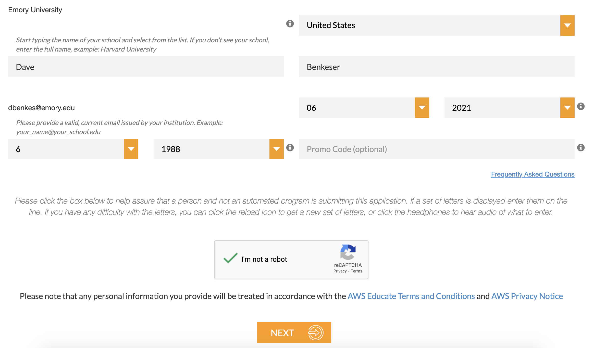
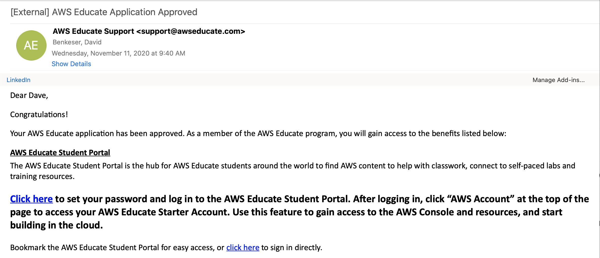
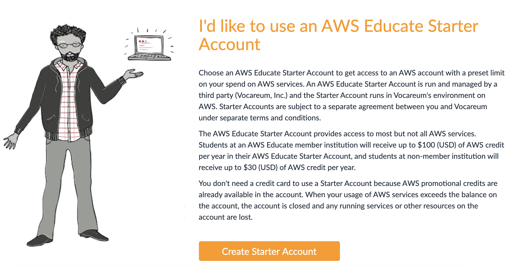
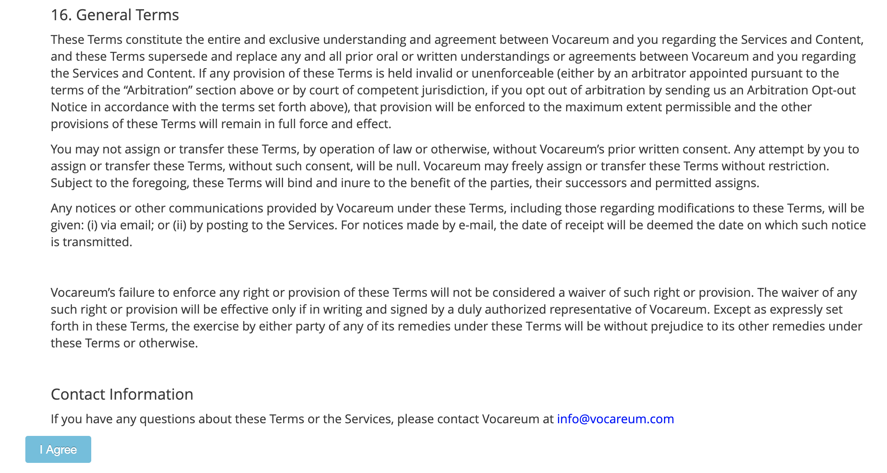
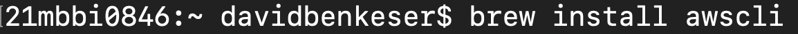
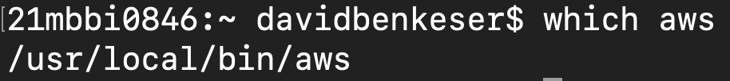
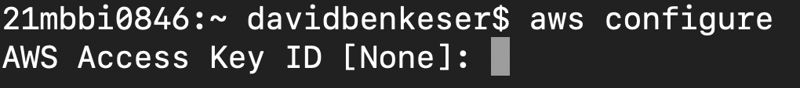
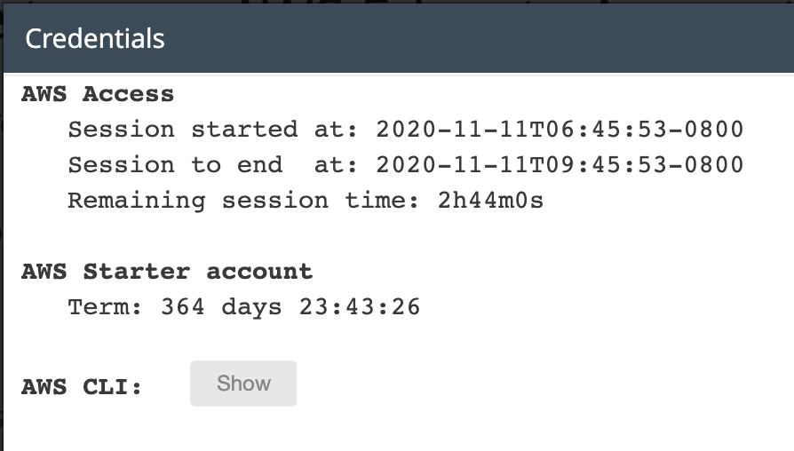

```{r, setup, include=FALSE}
knitr::opts_chunk$set(echo = FALSE)
```

### Welcome

In this guide, we'll talk through the set up of your AWS Educate starter account and installation of `awscli`. 

### AWS Educate set up

You should have received an email that looks like this:


Click on the hyperlink to complete the application. This takes you to a sign up page like this:



Complete the sign up and agree to the terms of service:


You'll receive an email at your Emory email address asking you to verify your email address:


Verify your address. Shortly after, you'll receive another email saying your application was approved:



Click on the hyperlink to set your password (choose something secure!!!). Then you'll be logged into your AWS educate account portal and should see the following header:


Click on "AWS Console" to provision your AWS account. 



Click "Create Starter Account". This will start the process of provisioning your account. 


You may need to click "Refresh" after a few minutes or the page may automatically reload when completed. When completed, you'll see this:


You'll have this account for a year, or until you've spent all your free compute. Click on "AWS Starter Account" and agree to the terms:



Now, you should see a page that has this box on it:


We will come back to the "Account Details" button shortly, so keep this browser open.

### Installing `awscli`

We will now install the AWS command line interface (`awscli`), which, as the name suggests, allows us to request AWS resources from the command line. Full instructions can be found [here](https://docs.aws.amazon.com/cli/latest/userguide/install-cliv2.html). 

I will suggest installing using homebrew (for Mac or WSL2 [i.e., Ubuntu for Windows] users). However you install, make sure that you install version 2!!! If using homebrew, you can execute the following.



When the install is completed, you'll see something like:


You can confirm the install was successful by checking whether the command `aws` can be found in your `PATH`. 



<!--
### Configuring `awscli`

We will now configure `awscli` to use your AWS account credentials. Typically, there would be an extra step here (setting up an IAM user); however, this isn't an option on AWS Educate. We'll discuss in class the role of IAM users. 

We will configure using the command `aws configure`.



Go back to your AWS educate account and click on Account Details:


You will see something like this:



Click on "Show" to see your AWS Access Key ID and AWS Secret Access Key. __IMPORTANT: Don't show these to anyone else!!!!__ Copy the AWS Access Key ID over to your terminal and hit "Return"/"Enter". Copy the AWS Secret Access Key and hit "Return"/"Enter". 

For region name, type `us-east-1`. The output format option controls the format of the output of `awscli` commands. If you are using `awscli` for advanced computing, it probably makes sense to select `json` or `yaml`, if you are only doing basic things, then I would go with `table`, which is more human readable, but can't be easily used in scripts. For this class, it doesn't really matter what you choose. 


This whole process, just creates a couple files that (on a Mac) live in the `~/.aws` directory. You can go and view the contents of those files to ensure that everything was entered properly. 
-->