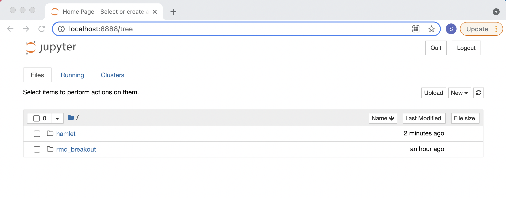
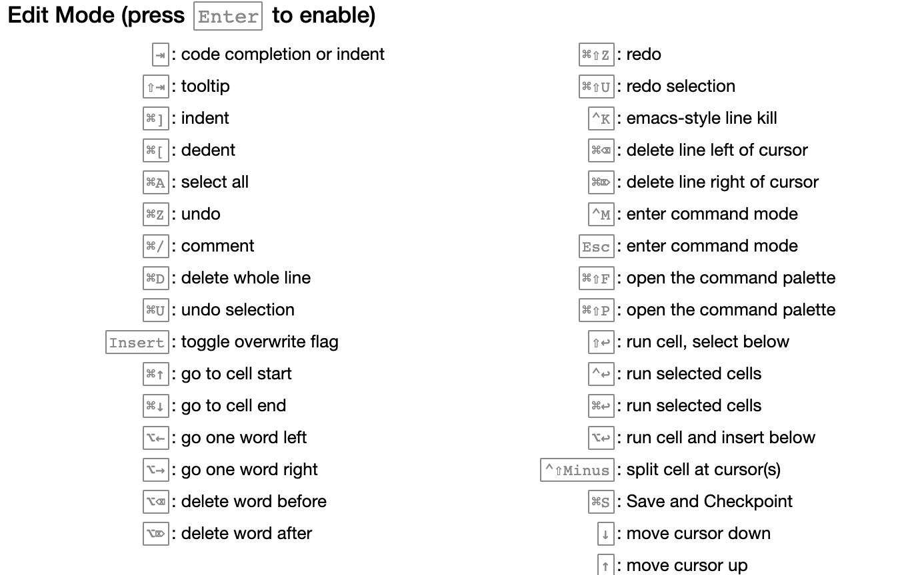

```{r xaringan-themer, include=FALSE, warning=FALSE}
library(xaringanthemer)
extra_css <- list(
    "ul" = list(`margin-bottom` = "0.5em",
      `margin-top` = "0.5em"),
        "p" = list(`margin-bottom` = "0.25em"),
        "ul li" = list(`margin-bottom` = "10px"),
        "a" = list(color = "#007dba"),
        "a:hover" = list("text-decoration" = "underline"),
        ".green" = list(color = "#348338"),
        ".red" = list(color = "#da291c")
)
style_mono_accent(
  base_color = "#012169",
  header_font_google = google_font("DM Sans"),
  text_font_google   = google_font("DM Sans", "400", "400i"),
  code_font_google   = google_font("Courier Prime"),
  extra_css = extra_css
)
```
<style type="text/css">
.remark-slide-content {
    font-size: 22px
}
</style>

## An interactive way to create reports

Imagine taking a compiled Rmarkdown report and typing directly into each code or markdown chunk!
 
* Run code chunks one at a time
* Make changes to text, figures, and other output without fully recompiling each time
* Write bash code within the notebook to install packages
* Easily embed HTML into text chunks 
* Share your report as HTML, PDF, and more
* Share your notebook so others build off your work 

---

## Jupyter Notebooks vs. Rmarkdown


---

## JSON files

* Jupyter Notebooks are saved as .ipynb files
* .ipynb files are JSON (Java Script Object Notation) files
* JSON files are just plain text and thus can be read/created in any programming language
* For python users: syntax looks just like a python dictionary


---

## Opening Jupyter Notebooks

* Navigate to your project directory and run this command in terminal

```{bash, openjn, eval = FALSE}
jupyter notebook
```

* A browser window will open with address `http://localhost:8888/tree`
* You should see the files that live in the directory you ran the command from


<center>
```{r, echo = FALSE, out.width = "600px"}

```
</center>

---

## Kernels

From the Jupyter Notebook docs:

"Kernels are programming language specific processes that run independently and interact with the Jupyter Applications and their user interfaces."

Find a list of all available kernels [here](https://github.com/jupyter/jupyter/wiki/Jupyter-kernels). We are most interested in:

* Ipython
* IRKernel


---

## Closing Jupyter Notebooks

* Closing the browser tab will not stop the server or shutdown notebooks 
* Ctrl + c stops the server and shuts down all running notebooks
* Shutting down a notebook kills the R/Python session
* To keep the server running, the terminal window we ran `jupyter notebook` from must be kept open

<center>
```{r, echo = FALSE, out.width = "500px"}
knitr::include_graphics("jn_running.png")
```
</center>


---

## Breakout Exercise 1

* Open a jupyter notebook
* Close the browser tab that opened automatically
* Figure out how to reopen the JN session in your browser


---

## Keyboard Shortcuts

There are tons of shortcuts! Don't need to learn them all.

<center>
```{r, echo = FALSE, out.width = "600px"}

```
</center>
---

## Displaying output with repr


---

## Magics (only for Ipython)

Magics are special commands that add functionality not readily available by just writing Python code and using the JN interface.

* Line magics start with `%`
* Cell magics stare with `%%`
* Run `%lsmagic` in a cell to list all available magics
* Many many magics!
* `%%bash` turns the whole cell into a bash cell
* `%%HTML` turns the whole cell into an HTML cell
* `%who_ls` lists all objects saved in the notebook
* `%timeit` provides a convenient way to time your code

---

## IRkernel magics?

.center[*We don’t and won’t support %%cell magic like %%HTML.*]

.center[\- The IRkernel dev team]

* Use the `system()` function to write bash code
* Use IRdisplay to embed images, html, etc

---

## Animated plots (Ipython only)

http://www.fundata.kr/python/ipython-notebook-tutorial/index.html


---

## rpy2: R and Python in the same notebook?? 


---

## Sharing notebooks


---

## Exporting notebooks


---

## Exporting code only


---

## Breakout Exercise 2

Here we'll work with the youtube video at this link: https://www.youtube.com/embed/dQw4w9WgXcQ


* Start a jupyter notebook session
* Start one Ipython kernel and one IRkernel
* Use a line magic to embed the video in the Ipython notebook (Hint: `%%HTML`)
* Use IRDisplay to embed the video in the IRkernel notebook (Hint: `IRdisplay::display_html()`)
* Save both notebooks as HTML files (save as something besides Untitled)
* Send both HTML files to someone in your breakout room
* Recieve two HTML files from someone in your breakout room
* Open the HTML files and watch the video


---


## Notebooks Online

* [mybinder](https://jupyter.org/try) (Just for playing around)
* [Google Colab](https://colab.research.google.com/) (Not exactly JN but similar functionality, free access to CPUs/GPUs, and pre-built enviroments for DS courtesy of Google!)

